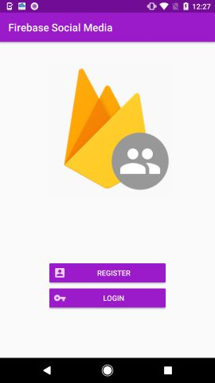
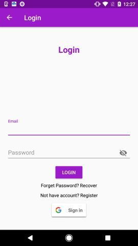
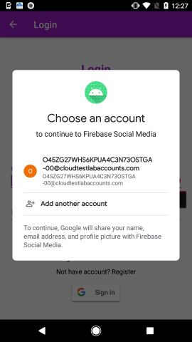
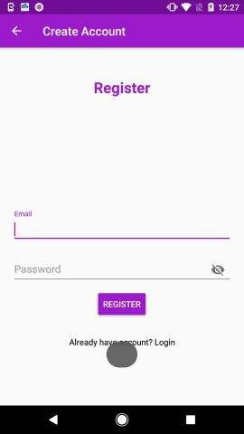
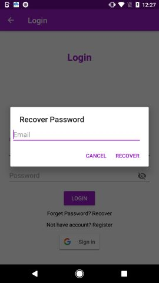
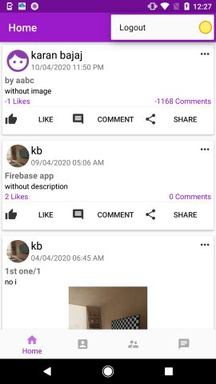

# FirebaseSocialMedia
Hello Everyone, I am going to build a Social media app.

The Features of This FirebaseSocialMedia Application is :

1. User Registration and login and Google Sign In.
3. Recover Password
5. Setup User Profile
6. Show User Profile
7. Edit User Profile
8. Show All Registered Users
9. Block Unblock Users
10. Search Users
11. Chat (send text and image) whit notification
12. ChatList
13. Publish Post with Notification
14. Post List with Search
15. Other User's Profile
16. Edit, Delete, Share Posts
17. Like, Comment Posts
18. Likes and Comments List
19. Notifications Screen

  
 
 
 
 
 
